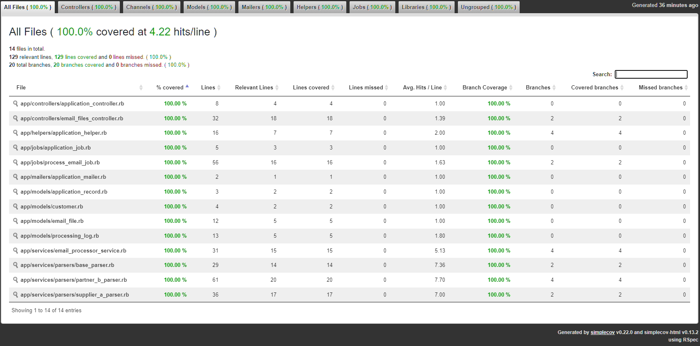

# Mail Parser App

Sistema de processamento de arquivos `.eml` para extração de informações de clientes, produtos e logs de processamento, utilizando Ruby on Rails 8, PostgreSQL, Sidekiq e Turbo Streams.

---

## 🚀 Subindo o projeto com Docker

Este projeto utiliza Docker e Docker Compose para facilitar a configuração dos serviços (Rails, PostgreSQL, Redis/Sidekiq) e garantir o deploy, em uma pipeline CI/CD.

### 1. Pré-requisitos

- Git
- Ruby: ruby-3.3.0
- Rails: 8.0.4
- Node.js e Yarn são gerenciados pelo container Rails
- docker: 29.0.0
- compose: 2.40.3
- redis (caso queira rodar local)
---

### 2. Clonando o projeto

```bash
git clone <REPOSITORY_URL>
cd mail_parser_app
```
### 3. Build e inicialização dos containers

```bash
docker compose -f docker-compose.prod.yml up --build
```
## isso irá subi os seguintes serviçõs 

* web → aplicação Rails
* db → PostgreSQL
* redis → cache e Sidekiq
* sidekiq → processamento de jobs

### 4. Criando o banco de dados 
```bash
docker exec -it web rails db:create RAILS_ENV=production
docker exec -it web rails db:migrate RAILS_ENV=production
```
### 5. Abra o navegador e Acesse a aplicação 

http://localhost:3000/

* Tela principal para upload de .eml
* Visualização de clientes criados
* Logs de processamento atualizados automaticamente com Turbo Streams

### 6. Rodando os testes (Se tiver ligado via docker vai fica em produção)
```bash
docker exec -it web rails db:create
docker exec -it web rails db:migrate
docker exec -it web rspec
```
# Bonus
para consulta a cobertura [este arquivo num browse](coverage/index.html) foi utilizado a gem coverage
Aqui está o painel principal:



#### OBS: 
- caso queira ligar tudo local configure pelo arquivo config/application.yml
- Basta instalar o redis local e o banco de dados postgres.